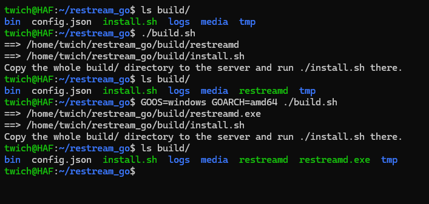

# Build from sources

The controller is a single Go binary with no third-party modules — the dashboard, the OBS files and the MediaMTX config template are all embedded in it. Building is one script; deploying is one directory (see the [README](../../README.md) for the overview, and [Setup](../Setup/Setup.md) for what to do after `install.sh`).

## Prerequisites

- **Go 1.26 or newer** on the machine you build on (`go.mod` pins `go 1.26`). That's the whole list: nothing is fetched from the module proxy, and no C toolchain is involved.
- Nothing on the VPS: `ffmpeg`, `srt-tools` and MediaMTX are installed there by `install.sh`, not built here.

## Build

```bash
git clone https://github.com/stalexteam/restream_go.git restream_go
cd restream_go
./build.sh
```

The Windows executable carries an application icon. `build.sh` generates it on Windows targets — the icon lives in `internal/assets/restreamd.ico`, and the linker reads it through `resource_windows_amd64.syso`, which is a build artifact, not a checked-in file. Building without `build.sh` still works; the executable just has no icon unless you run the generator first:

```bash
go run internal/assets/mkicon.go
```

That generator is plain Go with no external toolchain: `cvtres` output is unusable here because it emits absolute symbols (`@comp.id`, `@feat.00`) that make the Go linker fail with `sectnum < 0!`.

`build.sh` compiles the module root and lays out the distribution in `build/`:

```
build/
  restreamd     the controller — dashboard, OBS templates and mediamtx.yml template inside
  install.sh    the installer, copied from the source tree
```



Use a different toolchain with the `GO` variable — handy when `go` isn't on `PATH`:

```bash
GO=/usr/local/go/bin/go ./build.sh
```

`build/` is also the **installation root**: on the server `install.sh` creates `bin/`, `media/`, `logs/`, `tmp/` next to the binary, and `restreamd --config` writes `config.json`, `obs-dock.html` and `obs-source.html` there. Re-running `build.sh` over an existing install therefore only replaces `restreamd` and `install.sh` — your config, media and logs stay where they are.

## Cross-compiling for the server

`build.sh` builds for the machine it runs on. If that isn't the target, name the target explicitly — the usual VPS being Debian/Ubuntu x86-64:

```bash
GOOS=linux GOARCH=amd64 CGO_ENABLED=0 ./build.sh
```

`CGO_ENABLED=0` produces a static binary, so the server's glibc version stops mattering. Note that `install.sh` downloads the `linux_amd64` MediaMTX build — for a different architecture (an ARM VPS, say) edit the download line there to match.

The controller itself is portable Go and cross-builds for Windows too (`GOOS=windows GOARCH=amd64`, giving `restreamd.exe`, which then prints Windows-flavoured start/stop/firewall hints on `--config`). As in the screenshot above, that binary lands beside the Linux `restreamd` instead of replacing it, so one `build/` can hold both. `install.sh` is Debian/Ubuntu-only, so on Windows you place `restreamd.exe`, `ffmpeg` and `mediamtx` yourself and run `restreamd.exe --config`.

## Deploy

```bash
scp -r build/ user@vps:~/restream
ssh user@vps 'cd ~/restream && ./install.sh'
```

`install.sh` installs the packages and MediaMTX, registers the `restreamd` systemd unit, then hands over to `restreamd --config`, which prints the dashboard link and the OBS file paths. Continue from [Setup](../Setup/Setup.md).

## Tests

```bash
go test ./...
```

The suite is self-contained: no network, no external fixtures, no other runtime — everything a test needs is built by the test itself. It exercises the RTMP/FLV/TS wire code, the routing and timeline logic and the HTTP/WS API, so it's a meaningful check after a change, not a smoke test.
