# Setup

Follow these steps in order and you'll have one platform live. The rest — extra platforms, tuning, different feeds — you can explore afterwards (links at the bottom; see [What it does](../Overview/Overview.md) for the feature tour and the [README](../../README.md) for the overview).

## Prerequisites

- A VPS (Debian/Ubuntu, sudo, a public IP OBS can reach — a local Linux box/WSL works for testing; Windows works too, minus the installer, see step 1).
- OBS Studio on your streaming machine.
- Your platform's **RTMP Server + Stream Key** (Twitch/YouTube/Kick/…).
- A **backup video** to loop if your connection drops — any format `ffmpeg` reads (it's auto-matched to your stream).

## 1. Install and start

The controller ships as a single binary with the dashboard inside it. You either take a prebuilt one or build it yourself; either way you end up with a directory holding `restreamd` and `install.sh`, and that directory *is* the installation — everything the controller creates later (`config.json`, `bin/`, `media/`, `logs/`, `tmp/`) lands next to the binary.

**Option A — prebuilt release.** Download the Linux x86-64 archive from the [releases page](https://github.com/stalexteam/restream_go/releases/latest) and unpack it on the server:

```bash
mkdir -p ~/restream && cd ~/restream
tar -xzf ~/restreamd_linux_amd64.tar.gz
```

**Option B — build from sources.** One Go toolchain and one script; the result is `build/`, which you copy to the server — see **[Build from sources](../Build/Build.md)**:

```bash
git clone https://github.com/stalexteam/restream_go.git && cd restream_go
./build.sh
scp -r build/ user@vps:~/restream
```

Then, on the server, in that directory:

```bash
./install.sh
```

It installs `ffmpeg` + `srt-tools` and MediaMTX, registers the `restreamd` systemd service, and hands over to `restreamd --config`, which asks for this server's public IP/hostname and writes `config.json` (the only file you edit by hand — and mostly you won't, the dashboard's settings window covers it). At the end it prints, highlighted: the **dashboard URL with its token**, the paths to two generated local files — **`obs-dock.html`** (the dashboard) and **`obs-source.html`** (the OBS browser source) — the start/stop/logs commands, and the firewall ports to open. Re-print all of it anytime with `./restreamd --config`.

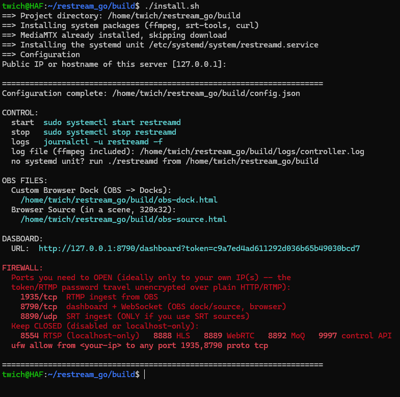

`install.sh` registered the controller as a systemd service, so from here it's the usual three commands:

```bash
sudo systemctl start restreamd
sudo systemctl status restreamd
sudo systemctl stop restreamd
```

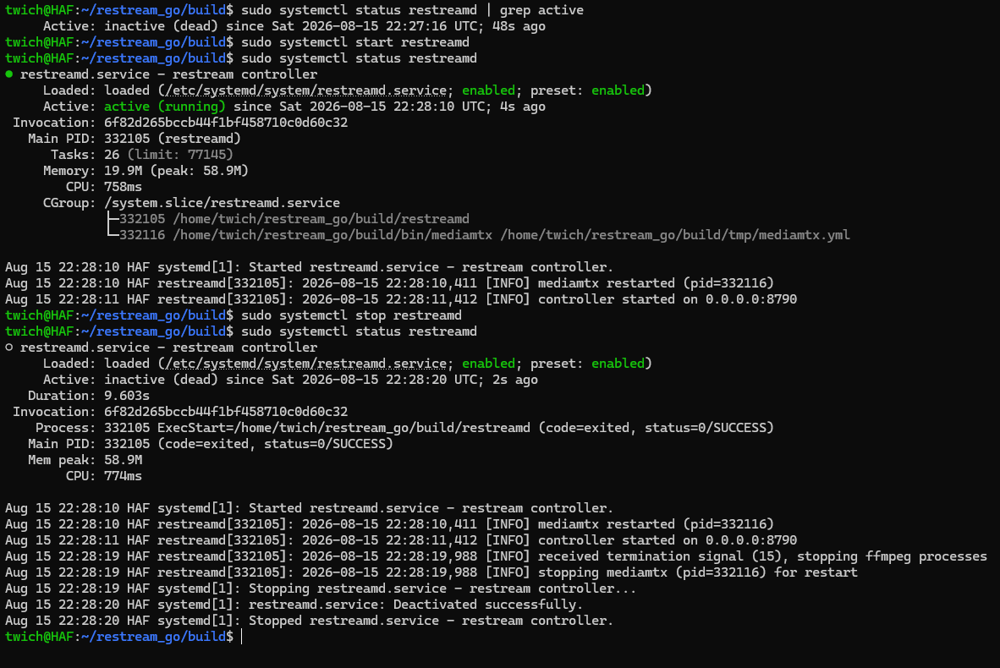

`status` is the quickest health check: it shows the controller and the `mediamtx` process it started underneath, plus the last log lines — `controller started on 0.0.0.0:8790` means it's up. The controller validates `config.json` on startup and refuses to run on a broken one, so a unit that won't start is a config error; `journalctl -u restreamd -f` follows the log live, and `logs/controller.log` keeps the same lines with the ffmpeg output alongside.

Without systemd (a container, WSL), run `./restreamd` from the install directory instead. Re-print the dashboard link and the OBS file paths anytime with `./restreamd --config`: it only asks for the public host again (Enter keeps the current one) and rewrites the OBS files — your platforms, sources and secrets stay as they are.

**On Windows it looks different.** `install.sh` is Debian/Ubuntu-only, so there is nothing to run: take `restreamd.exe` (a prebuilt one, or `GOOS=windows GOARCH=amd64 ./build.sh` — see [Build from sources](../Build/Build.md)), put it in a folder of its own, drop `mediamtx.exe` into `bin\` beside it and have `ffmpeg.exe` on `PATH`. From there `restreamd.exe --config` does exactly the same setup as on Linux and prints the same summary with Windows commands in it: **start** is the executable itself, **stop** is Ctrl+C in its window, the log is `logs\controller.log`, and the firewall line is a `netsh advfirewall` rule instead of `ufw`. There's no service — the console window *is* the service, so keep it open (or wrap it in Task Scheduler / NSSM yourself).

## 2. Reach the dashboard and config

Open the dashboard — best added to OBS as a **Custom Browser Dock** pointed at `obs-dock.html` (copy it to the OBS machine; OBS takes a plain path like `C:\obs-dock.html`).

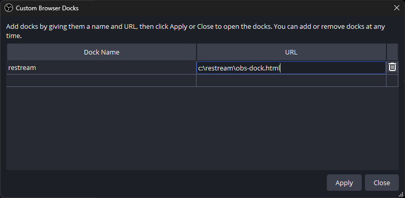

The dock itself stays deliberately small — **Status** and **Control** only. Nothing is configured in the dock.

Everything you configure lives behind the **⚙ Settings** button in the dock's header: clicking it opens the configuration in a **separate window**, so the dock keeps showing status while you work. Inside OBS that window has no address bar, so nothing sensitive is on screen if the dock is ever visible on stream. (In a plain browser tab — or if a popup blocker gets in the way — the same page opens as an overlay on top of the dashboard instead; **Esc** closes it.)

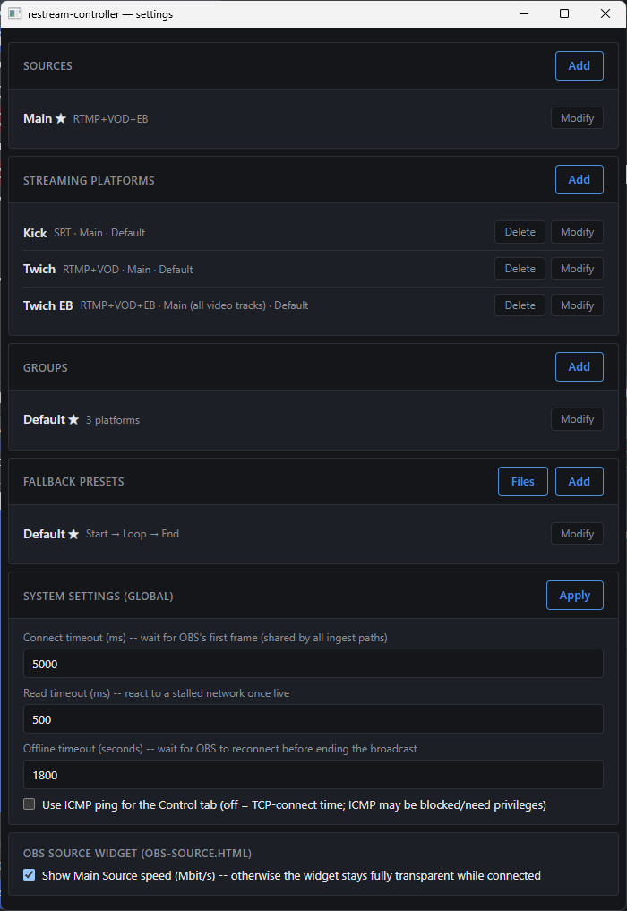

That window is the map for the rest of this guide, top to bottom: **Sources** (what OBS sends in), **Streaming Platforms** (where it goes out — each line shows its type, the source it draws from and its group), **Groups** (a switch that flips several platforms at once), **Fallback presets** (what plays when the uplink drops, plus the **Files** manager for the server's media), and **System settings** — the timeouts and the OBS source widget's options. A **★** marks the default entry of its block. Everything here is edited through **Add** / **Modify** dialogs; nothing needs the config file.

## 3. Add a backup video

This is the clip every platform switches to when your uplink drops, so put one in before you go live. It's a dashboard job: in the settings window open **Fallback presets → Files** — a small file manager for the server's `media/` folder. Drag a video onto it to upload; make folders, rename and delete from there; **Preview** plays any file straight from the server, so you can check a clip without downloading it first. The default preset loops **`backup.mp4`**, so uploading your clip under that name is the whole setup. (Copying files into `media/` over SSH still works if you prefer.)

**Where to get one:** hit **Start Recording** in OBS for a few seconds — same scene, same output settings you're about to stream with — then **Stop Recording** and upload that file. Recorded straight out of OBS it matches your stream exactly. It doesn't have to, though: the clip is auto-transcoded to your stream's resolution/fps/bitrate the first time OBS connects, so any format `ffmpeg` reads will do.

Uploads must carry **both a video and an audio track** — a silent clip is rejected on upload instead of failing in the middle of a broadcast. Everything the fallback machinery touches lives inside `media/` and is written down relative to it: a preset field holds `start.mp4` or `clips/`, never a full path. The **Browse** button next to each field opens a picker, so there's normally nothing to type — and if you do type, the field completes as you go (Tab accepts) and turns red the moment the path stops pointing at something usable. A file or folder a preset points at can't be deleted or renamed until you point that preset somewhere else.

## 4. Configure the source and OBS

In the settings window there's already a default source named **Main** — **Modify** it and set its **Type** to what it should receive from OBS:

- **RTMP** — 1 video + 1 audio track. OBS: Service **Custom**. Tick **Twitch VOD Track** to add a second (Live, VOD) audio track — OBS: Service **Twitch**, plus **Twitch VOD Track** ticked in Output → Streaming.
- **SRT (multitrack)** — 1 video + up to 6 audio tracks; set **Audio tracks count** to how many. OBS: Service **Custom**, Server = the source's `srt://…` URL, plus matching **Audio Track** checkboxes ticked in Output → Streaming.

Each source's own Server/Stream Key (or SRT URL) is in its Modify dialog — screenshots below show the exact match for each type.

<details>
<summary>Screenshot — RTMP source + the matching OBS Settings → Stream</summary>

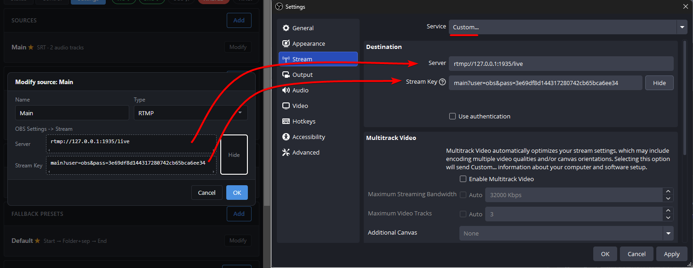

</details>

<details>
<summary>Screenshot — RTMP source with VOD Track enabled + the matching OBS Settings → Stream and Output → Twitch VOD Track</summary>

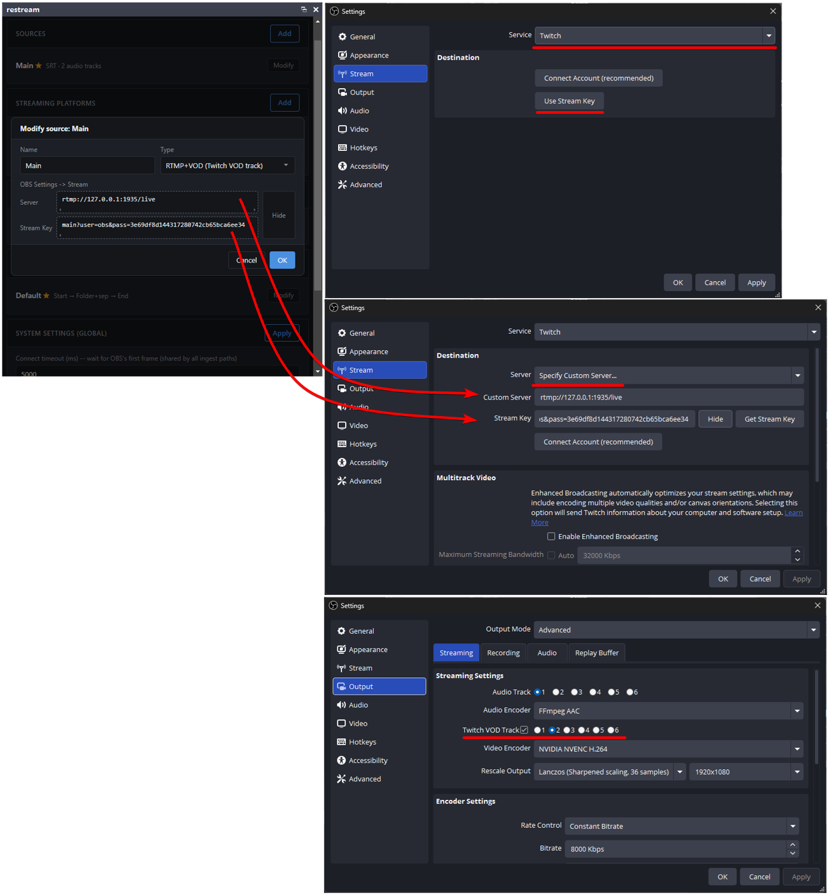

</details>

<details>
<summary>Screenshot — SRT multitrack source + the matching OBS Settings → Stream and Output → Audio Track checkboxes</summary>

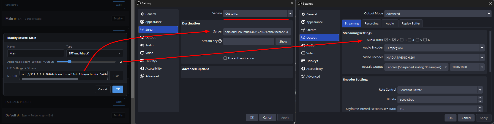

</details>

An RTMP source also has **Enable Enhanced Broadcasting** — tick it when OBS streams a Twitch multitrack video ladder (Service **Twitch** with Enhanced Broadcasting on, several renditions in one connection). **Maximum Video tracks**, next to the checkbox, then mirrors the setting of the same name in OBS (1…5, or AUTO to make no claim). Such a source can then feed Twitch the **whole ladder** and every other platform one rendition of it — see [Add a streaming platform](#5-add-a-streaming-platform). Two rules the service enforces on such a source: every video track must be **H.264**, and all of them must share one **aspect ratio** — that is, one canvas. A second (vertical) canvas breaks both, so Dual Format / Aitum Vertical is not supported yet.

Whichever type you pick, the audio track count is a **contract**: the service checks what actually arrives against it and holds platforms back on a mismatch (see [Troubleshooting](../Troubleshooting/Troubleshooting.md)).

One more thing applies no matter the source type — **Settings → Output (Advanced) → Streaming**: **Rate Control: CBR** (not "Lossless") with an explicit bitrate, and **Keyframe Interval: 2 s** (visible in the Output panel in the screenshots above).

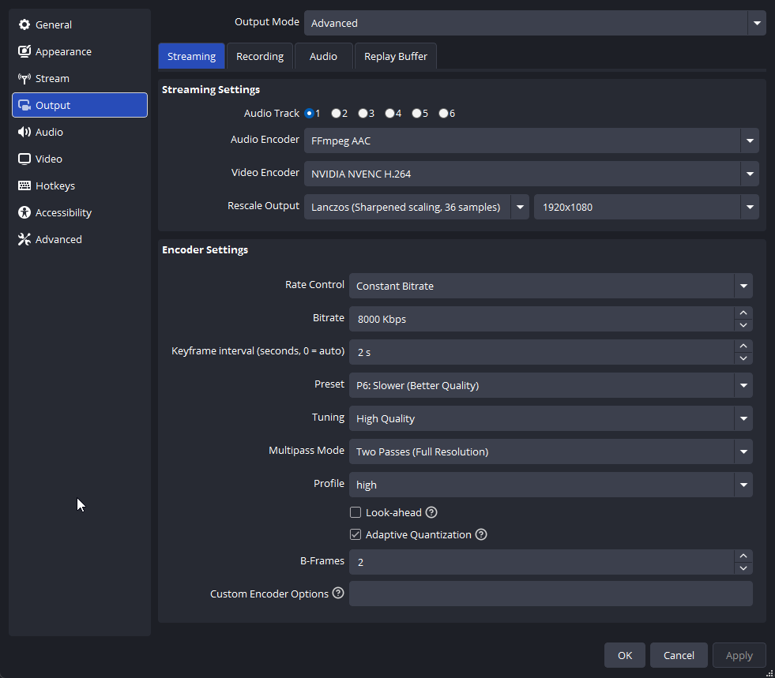

## 5. Add a streaming platform

Back in the settings window, hit **Add** under **Streaming Platforms**, name it, and pick a **Type** — Server + Stream Key for RTMP, Server + Stream ID + Passphrase for SRT.

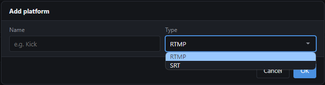

Then pick its **Video source** and, by Type, which of that source's audio track(s) to send — every platform draws from exactly one source. A plain source is one entry in the list; an Enhanced Broadcasting source is several: **all video tracks** (the whole ladder, RTMP platforms only) plus each rendition separately, labelled with its geometry, e.g. `Main #2 1280x720@60`:

- **RTMP** — one **Audio track**; tick **Twitch VOD Track** to send a **Live audio track** and a **VOD audio track** instead (any two of the source's tracks, duplicates allowed).
- **SRT** — up to 6 **Track #N** slots, each any track of the source or `None`. Before mapping more than one, check that the platform actually accepts multi-audio SRT — most don't (Kick drops the connection outright), see [Platform limitations](../Troubleshooting/Troubleshooting.md#platform-limitations).

A **Clone** button appears whenever some source has the platform's own type: it fills the whole builder from that source 1:1 — its VOD Track state, its ladder (an Enhanced Broadcasting source is cloned as *all video tracks*) and its audio tracks in order.

Picking **all video tracks** makes that platform the Enhanced Broadcasting arm (Control marks it with an **EB** badge — the same one the Status tab shows next to an Enhanced Broadcasting source). Only its **Stream Key** is used — Twitch assigns the ingest URL when the broadcast starts, so the Server field is greyed out. Everything else works as on any other platform, with one thing worth knowing: its fallback video is re-encoded into every rung of the ladder, so it is ready a bit later than the others' — the **fallback-preparer** row on the Status tab shows how far that has got.

<details>
<summary>Screenshot — RTMP platform, from an RTMP+VOD+EB source and from an SRT source</summary>

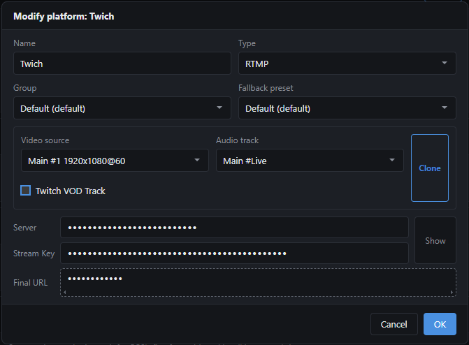
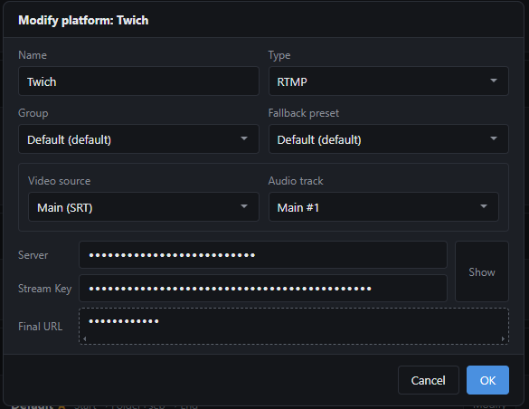

</details>

<details>
<summary>Screenshot — RTMP platform with VOD Track enabled, from an RTMP+VOD+EB source and from an SRT source</summary>

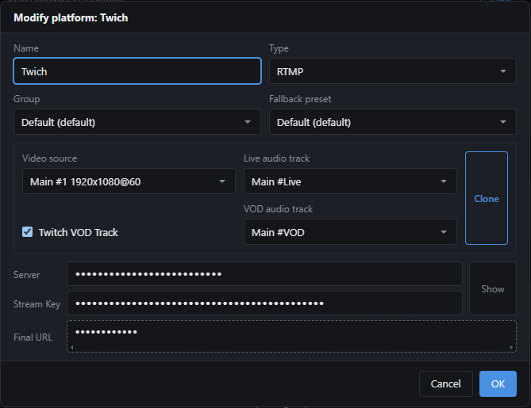
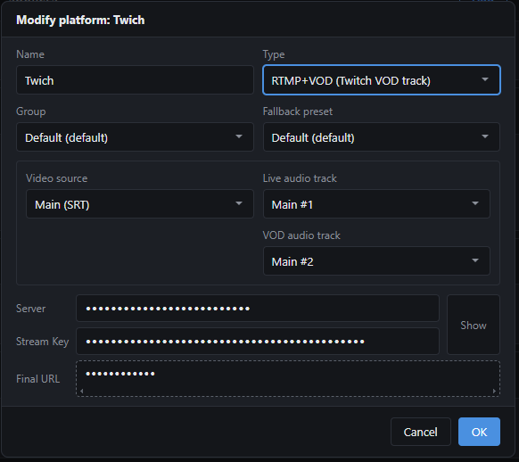

</details>

<details>
<summary>Screenshot — SRT platform, from an RTMP+VOD source and from an SRT source</summary>

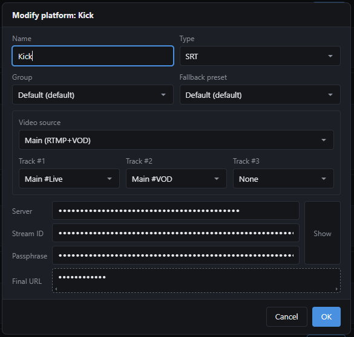
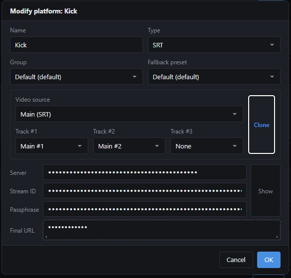

</details>

New platforms start **disabled**; flip its checkbox on the **Control** tab once its credentials are saved to bring it live. Add as many as you want, each independently on/off — see [everyday scenarios](../Scenarios/Scenarios.md) for how the service behaves once more than one is running.

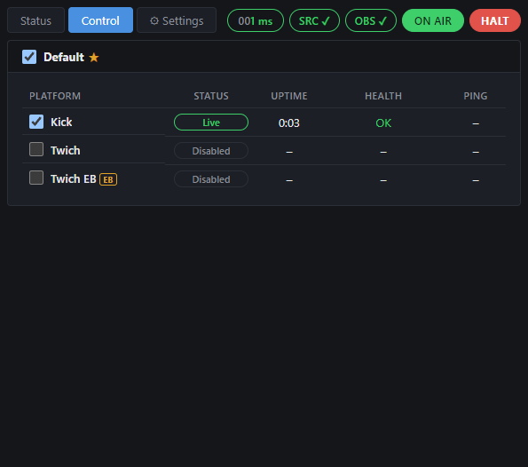

## 6. Add the browser source

Add **`obs-source.html`** as a **Browser Source** (any scene, size **320×32**) and set its **Page permission** to **"Full access to OBS"**. This is what makes deliberate Start/Stop detection — and remote stop — work. The page stays fully transparent by default; it only shows a small corner indicator on a dropped connection, or — if you enable **"Show Main Source speed"** in the settings window — a small Mbit/s readout. Since this is a Browser Source (not a dock), whatever it shows goes into the live output and the recording.

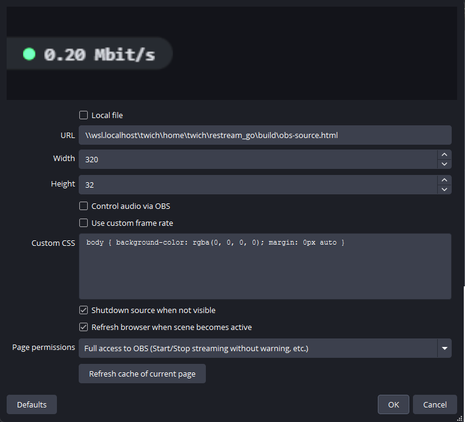

## 7. Go live

Hit **Start Streaming** in OBS, then watch the dashboard's **Status** tab (or `sudo systemctl status restreamd`). The red **HALT** button in the header is an emergency stop, usable from your phone.

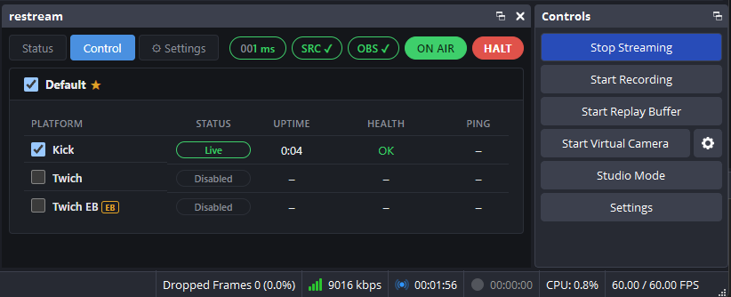

---

**Beyond one platform:** [everyday scenarios](../Scenarios/Scenarios.md) · [troubleshooting](../Troubleshooting/Troubleshooting.md). Day-to-day: `sudo systemctl stop | restart restreamd`, `journalctl -u restreamd -f`, `./restreamd --config` to re-print the credentials.
