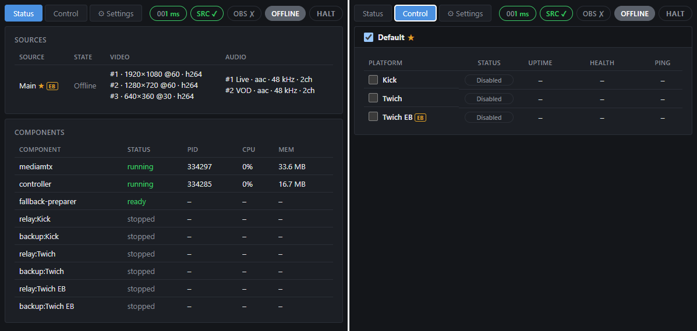
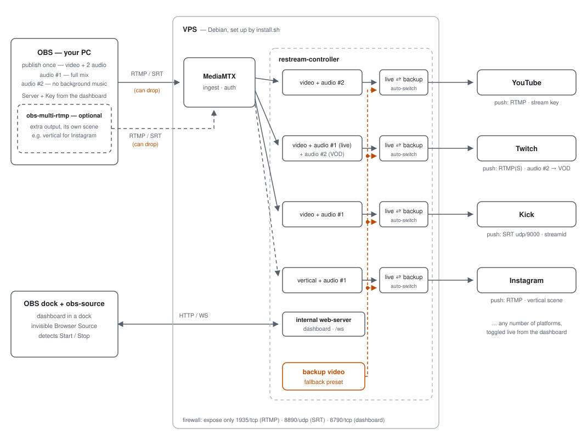

# restream-controller

Continuous OBS -> multi-platform restreaming: publish once from OBS (RTMP, or SRT with several audio tracks) and the VPS relays it to any number of platforms (Twitch, YouTube, Kick, …) you enable, each platform picking its own video/audio from your feed. If your internet connection drops, the stream doesn't end — every enabled platform switches to a backup video until the connection comes back (or until a timeout is reached).



## Quick start

Take a prebuilt `restreamd` from the [releases page](https://github.com/stalexteam/restream_go/releases/latest), or build one — a Go toolchain and a script, no dependencies to resolve:

```bash
git clone https://github.com/stalexteam/restream_go.git && cd restream_go
./build.sh                       # -> build/restreamd + build/install.sh
scp -r build/ user@vps:~/restream
```

Then, on the server:

```bash
cd ~/restream && ./install.sh    # packages, MediaMTX, systemd unit, config
sudo systemctl start restreamd
```

`install.sh` prints the dashboard URL and the two generated OBS files to point OBS at. The full walkthrough — OBS settings, sources, platforms — is in **[Setup](Doc/Setup/Setup.md)**.

## Documentation

- **[What it does](Doc/Overview/Overview.md)** - the feature tour: sources vs platforms, fallback, groups, contracts.
- **[Setup & operation](Doc/Setup/Setup.md)** - prerequisites, install, configuring OBS and platforms, and day-to-day management.
- **[Build from sources](Doc/Build/Build.md)** - one Go toolchain, `./build.sh`, and the `build/` directory you copy to the server.
- **[Everyday scenarios](Doc/Scenarios/Scenarios.md)** - how the service behaves when things happen: drops, stops, wrong keys, mid-stream changes.
- **[Troubleshooting](Doc/Troubleshooting/Troubleshooting.md)** - when something misbehaves.

## How it works

<picture>
  <source media="(prefers-color-scheme: dark)" srcset="Doc/architecture-dark.svg">
  
</picture>

*One publish from OBS; the VPS builds each platform its own stream — its own audio-track pick, its own live ⇄ backup switch — and keeps pushing over a connection that never drops, even while your uplink is down. An optional [obs-multi-rtmp](https://github.com/sorayuki/obs-multi-rtmp) output can feed extra sources — e.g. a vertical scene for vertical-video platforms.*

## Security

This is built for a VPS you own, reachable only by you: the dashboard and both ingest protocols are unencrypted, so the ports they use should be firewalled to your own address. Read **[SECURITY.md](SECURITY.md)** before opening anything to the internet — it also covers how to report a vulnerability.

## License

MIT — see **[LICENSE](LICENSE)**.

The controller is a single standard-library Go binary — no third-party modules, nothing vendored — and the dashboard it serves uses no third-party JavaScript or CSS. MediaMTX, FFmpeg and srt-tools are installed on your machine by `install.sh` rather than redistributed here; **[THIRD-PARTY.md](THIRD-PARTY.md)** lists them and their licenses.
